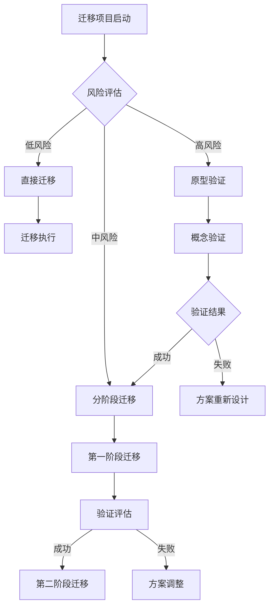

# 模块化架构设计文档
## 业务代码可迁移性的实现原理与可行性分析

---

## 执行摘要

本文档提出了一种深度模块化的技术架构方案，旨在解决现代企业在架构选择上的核心困境：如何在微服务的复杂性和单体的局限性之间取得平衡。通过模块化设计原理、业务逻辑抽象和配置驱动的部署机制，实现业务代码在云原生微服务架构和独立单体应用之间的无缝迁移，为企业提供真正的架构灵活性。

### 核心价值主张
- **零迁移成本**：业务代码无需修改即可在不同部署模式间切换
- **架构灵活性**：根据业务需求选择最适合的部署模式
- **投资保护**：保护现有技术投资，避免重复开发
- **渐进演进**：支持从单体到微服务的渐进式架构演进

---

## 1. 模块化架构原理设计

### 1.1 模块化设计的理论基础

#### 设计原则体系
模块化架构基于SOLID原则和DDD（领域驱动设计）理念，形成了一套完整的设计原则体系：

**核心设计原则：**
- **单一职责原则（SRP）**：每个模块聚焦于特定的业务能力，具有明确的业务边界
- **依赖倒置原则（DIP）**：高层模块不依赖低层模块，都依赖于抽象接口
- **接口隔离原则（ISP）**：通过细粒度的接口避免不必要的依赖关系
- **开闭原则（OCP）**：对扩展开放，对修改关闭，支持模块的独立演进

#### 业务能力边界划分
基于DDD的限界上下文（Bounded Context）理论，进行业务模块的边界划分：

**划分标准：**
- **业务一致性**：模块内部具有统一的业务语言和规则
- **数据所有权**：每个模块拥有独立的数据模型和存储
- **团队边界**：模块边界与团队组织边界保持一致
- **变更频率**：变更频率相似的功能集中在同一模块

**实现机制：**
```
业务能力识别 → 限界上下文划分 → 接口契约定义 → 依赖关系设计
```

### 1.2 业务逻辑抽象层设计

#### 四层架构模型
建立清晰的分层架构，确保业务逻辑与技术实现的完全解耦：

**架构层次：**
1. **业务逻辑层（Business Logic Layer）**
   - 纯粹的业务规则和流程定义
   - 与具体技术实现完全无关
   - 通过领域模型表达业务概念

2. **服务接口层（Service Interface Layer）**
   - 定义业务能力的对外接口和契约
   - 提供标准化的API定义
   - 支持多种协议和数据格式

3. **适配器层（Adapter Layer）**
   - 连接业务逻辑与外部系统
   - 适配不同的技术框架和基础设施
   - 实现协议转换和数据映射

4. **基础设施层（Infrastructure Layer）**
   - 提供数据持久化、消息传递等基础服务
   - 封装技术细节，提供统一接口
   - 支持多种技术实现的替换

#### 解耦策略设计
**技术无关性解耦：**
- 业务逻辑不依赖具体的技术实现
- 通过接口定义替代具体类依赖
- 使用依赖注入管理组件关系

**环境无关性解耦：**
- 通过配置适配不同的运行环境
- 支持云环境和本地环境的无缝切换
- 提供环境特定的优化和适配

**协议无关性解耦：**
- 支持HTTP、gRPC、消息队列等多种通信协议
- 统一的数据格式和序列化机制
- 协议适配器模式实现协议转换

**存储无关性解耦：**
- 通过Repository抽象数据访问
- 支持关系型数据库、NoSQL、内存存储
- 数据迁移和同步机制

### 1.3 模块边界划分和依赖关系管理

#### 模块边界管理策略
**边界划分原则：**
- **高内聚**：模块内部功能紧密相关
- **低耦合**：模块间依赖关系最小化
- **单向依赖**：避免循环依赖关系
- **接口契约**：通过明确的接口定义交互

**依赖层次设计：**
```
应用层（Application Layer）
    ↓
业务层（Business Layer）
    ↓
领域层（Domain Layer）
    ↓
基础设施层（Infrastructure Layer）
```

#### 依赖关系管理机制
**依赖注入容器：**
- 管理模块间的依赖关系和生命周期
- 支持不同环境下的实现替换
- 提供配置驱动的组件组装

**版本兼容性管理：**
- 定义接口版本演进规则
- 支持向后兼容的接口变更
- 版本冲突检测和解决机制

**循环依赖避免：**
- 通过架构层次避免循环依赖
- 依赖关系图分析和检测
- 重构指导原则和最佳实践

### 1.4 模块独立性和可组合性评估

#### 模块独立性评估标准
**功能独立性：**
- 单一职责：模块聚焦单一业务能力
- 接口稳定：对外接口变更频率低
- 数据封闭：内部数据模型不对外暴露

**技术独立性：**
- 技术栈无关：可使用不同技术栈实现
- 部署独立：可独立部署和运行
- 测试独立：可独立进行单元测试和集成测试

**团队独立性：**
- 团队边界：与开发团队边界一致
- 决策独立：技术决策不依赖其他团队
- 发布独立：可独立制定发布计划

#### 可组合性评估框架
**组合能力指标：**
- **接口兼容性**：标准化的接口定义和数据格式
- **配置灵活性**：支持运行时配置和动态组合
- **依赖解析**：自动化的依赖解析和冲突处理
- **版本管理**：多版本并存和兼容性管理

**组合策略：**
- **静态组合**：编译时确定模块组合
- **动态组合**：运行时动态加载和卸载模块
- **条件组合**：基于环境或条件选择性加载模块
- **分层组合**：不同层次的模块组合策略

---

## 2. 业务代码可迁移性方案

### 2.1 业务逻辑与部署模式解耦技术

#### 抽象层架构设计
**业务逻辑抽象：**
业务逻辑通过标准的接口抽象与具体部署模式完全解耦：

```
业务逻辑 → 业务接口 → 适配器接口 → 具体实现
```

**适配器模式实现：**
- **微服务适配器**：实现分布式架构下的组件协作
- **单体适配器**：实现单体架构下的进程内通信
- **混合适配器**：支持混合部署模式的协调机制

#### 配置驱动的架构切换
**配置策略设计：**
- **部署模式配置**：通过环境变量指定部署模式
- **模块组合配置**：定义要包含的业务模块
- **通信方式配置**：配置模块间通信机制
- **基础设施配置**：适配不同环境的基础设施

**动态适配机制：**
- **启动时检测**：自动检测运行环境和配置
- **组件装配**：根据配置动态组装组件
- **接口代理**：统一的接口代理和路由机制
- **异常处理**：统一的异常处理和错误恢复

### 2.2 代码结构和组织形式标准化

#### 标准项目结构设计
**模块化项目结构：**
```
business-platform/
├── business-logic/                 # 业务逻辑模块
│   ├── user-service/              # 用户业务模块
│   │   ├── domain/               # 领域模型
│   │   ├── service/              # 业务服务
│   │   └── repository/           # 数据访问接口
│   ├── order-service/             # 订单业务模块
│   └── payment-service/           # 支付业务模块
├── service-interfaces/            # 服务接口定义
│   ├── user-api/                  # 用户服务接口
│   ├── order-api/                 # 订单服务接口
│   └── payment-api/               # 支付服务接口
├── adapters/                      # 适配器实现
│   ├── cloud-adapters/           # 云原生适配器
│   │   ├── service-discovery/    # 服务发现
│   │   ├── message-queue/        # 消息队列
│   │   └── load-balancer/        # 负载均衡
│   └── monolith-adapters/        # 单体适配器
│       ├── in-memory-queue/      # 内存队列
│       ├── local-cache/          # 本地缓存
│       └── direct-call/          # 直接调用
├── infrastructure/               # 基础设施组件
│   ├── database/                # 数据库组件
│   ├── cache/                   # 缓存组件
│   └── messaging/               # 消息组件
├── deployment-configs/           # 部署配置
│   ├── microservice/            # 微服务配置
│   ├── monolith/                # 单体配置
│   └── hybrid/                  # 混合模式配置
└── shared/                      # 共享组件
    ├── common/                  # 通用组件
    ├── utils/                   # 工具类
    └── exceptions/              # 异常定义
```

#### 依赖管理规范
**模块依赖原则：**
- **接口依赖**：模块间只依赖接口定义
- **实现无关**：不依赖具体实现类
- **版本兼容**：定义接口版本兼容规则
- **循环避免**：通过依赖层次避免循环依赖

**构建和打包策略：**
- **模块化构建**：支持独立模块构建
- **依赖解析**：自动化依赖解析和管理
- **版本管理**：统一的版本号管理策略
- **质量检查**：集成代码质量检查和安全扫描

### 2.3 配置驱动的部署模式切换机制

#### 配置管理架构
**配置层次设计：**
1. **全局配置**：系统级别的全局配置
2. **环境配置**：特定环境的配置（开发、测试、生产）
3. **部署配置**：部署模式相关配置
4. **模块配置**：模块级别的配置

**配置切换策略：**
```yaml
# 部署模式配置示例
deployment:
  mode: ${DEPLOYMENT_MODE:monolith}  # microservice | monolith | hybrid

  # 微服务配置
  microservice:
    service-discovery:
      type: consul  # consul | eureka | nacos
      host: ${CONSUL_HOST:localhost}
      port: ${CONSUL_PORT:8500}

    message-queue:
      type: rabbitmq  # rabbitmq | kafka | redis
      host: ${RABBITMQ_HOST:localhost}
      port: ${RABBITMQ_PORT:5672}

    load-balancer:
      type: ribbon  # ribbon | spring-cloud-loadbalancer

  # 单体配置
  monolith:
    in-memory-queue:
      capacity: 10000
      timeout: 5000

    local-cache:
      type: caffeine  # caffeine | guava
      max-size: 10000
      expire-after-write: 10m

    direct-call:
      timeout: 3000
      retry-count: 3
```

#### 运行时适配机制
**启动时检测：**
- 环境变量检测和解析
- 配置文件加载和验证
- 部署模式自动识别
- 组件依赖检查和装配

**动态适配：**
- 适配器工厂模式实现
- 基于配置的组件选择
- 运行时组件替换机制
- 热更新和配置刷新

### 2.4 业务一致性保证机制

#### 功能一致性保证
**接口统一性：**
- 标准化的API接口定义
- 统一的数据格式和协议
- 一致的错误处理机制
- 统一的认证和授权

**行为一致性：**
- 业务规则在不同模式下保持一致
- 数据验证和约束的一致性
- 事务处理的一致性保证
- 幂等性和一致性要求

#### 数据一致性策略
**分布式数据一致性：**
- 最终一致性模型
- 事件溯源和CQRS模式
- 补偿事务模式
- 分布式事务协调

**单体数据一致性：**
- ACID事务保证
- 本地事务管理
- 数据锁定机制
- 一致性检查和修复

---

## 3. 多种打包和部署模式设计

### 3.1 云原生微服务打包和部署方案

#### 容器化打包策略
**独立容器镜像设计：**
每个业务模块打包为独立的Docker镜像，支持独立部署和扩展：

```dockerfile
# 多阶段构建示例
FROM maven:3.9-openjdk-17 AS builder
WORKDIR /app
COPY pom.xml .
COPY src ./src
RUN mvn clean package -DskipTests

FROM openjdk:17-jre-slim
WORKDIR /app
COPY --from=builder /app/target/*.jar app.jar
EXPOSE 8080
ENTRYPOINT ["java", "-jar", "app.jar"]
```

**镜像优化策略：**
- **多阶段构建**：减少最终镜像大小
- **分层缓存**：利用Docker层缓存提高构建速度
- **基础镜像标准化**：统一的基础镜像和安全更新
- **安全扫描集成**：自动化安全漏洞扫描

#### Kubernetes编排方案
**K3s轻量级Kubernetes部署：**
```yaml
# 微服务部署示例
apiVersion: apps/v1
kind: Deployment
metadata:
  name: user-service
spec:
  replicas: 3
  selector:
    matchLabels:
      app: user-service
  template:
    metadata:
      labels:
        app: user-service
    spec:
      containers:
      - name: user-service
        image: user-service:latest
        ports:
        - containerPort: 8080
        env:
        - name: DEPLOYMENT_MODE
          value: "microservice"
        - name: CONSUL_HOST
          value: "consul"
        resources:
          requests:
            memory: "512Mi"
            cpu: "500m"
          limits:
            memory: "1Gi"
            cpu: "1000m"
        livenessProbe:
          httpGet:
            path: /actuator/health
            port: 8080
          initialDelaySeconds: 60
        readinessProbe:
          httpGet:
            path: /actuator/health
            port: 8080
          initialDelaySeconds: 30
---
apiVersion: v1
kind: Service
metadata:
  name: user-service
spec:
  selector:
    app: user-service
  ports:
  - port: 8080
    targetPort: 8080
  type: ClusterIP
```

**服务网格集成：**
- Istio服务网格用于流量管理
- 自动服务发现和负载均衡
- 熔断器和重试机制
- 分布式追踪和监控

#### 微服务治理机制
**服务发现和注册：**
- Consul/Nacos服务注册中心
- 健康检查和故障检测
- 服务元数据管理
- 服务版本管理

**配置管理：**
- 集中配置中心
- 动态配置刷新
- 配置版本管理
- 配置加密和安全

**监控和观测：**
- Prometheus指标收集
- Grafana可视化监控
- 分布式链路追踪
- 日志聚合和分析

### 3.2 独立单体应用打包和部署方案

#### 单体应用打包策略
**Fat JAR打包方案：**
```dockerfile
# 单体应用Docker镜像
FROM openjdk:17-jre-slim
WORKDIR /app

# 复制应用JAR文件
COPY business-platform.jar app.jar

# 创建用户和目录
RUN groupadd -r appuser && useradd -r -g appuser appuser
RUN chown -R appuser:appuser /app

# 切换到非root用户
USER appuser

# 健康检查
HEALTHCHECK --interval=30s --timeout=10s --start-period=60s --retries=3 \
  CMD curl -f http://localhost:8080/actuator/health || exit 1

# 启动应用
EXPOSE 8080
ENTRYPOINT ["java", "-jar", "-Dspring.profiles.active=monolith", "app.jar"]
```

**模块化JAR优化：**
- JPMS（Java Platform Module System）模块化
- 启动时间优化
- 内存占用优化
- 类加载隔离

#### 传统部署方案
**物理机/虚拟机部署：**
- 系统服务配置（systemd）
- 进程监控和自动重启
- 日志轮转和管理
- 备份和恢复策略

**容器化部署：**
- 单容器运行完整应用
- 资源限制和监控
- 数据卷挂载
- 网络配置

**负载均衡配置：**
```nginx
# Nginx负载均衡配置
upstream business_app {
    server 192.168.1.10:8080 weight=3;
    server 192.168.1.11:8080 weight=2;
    server 192.168.1.12:8080 weight=1;
}

server {
    listen 80;
    server_name business.example.com;

    location / {
        proxy_pass http://business_app;
        proxy_set_header Host $host;
        proxy_set_header X-Real-IP $remote_addr;
        proxy_set_header X-Forwarded-For $proxy_add_x_forwarded_for;

        # 健康检查
        proxy_next_upstream error timeout invalid_header http_500 http_502 http_503;
        proxy_connect_timeout 5s;
        proxy_send_timeout 10s;
        proxy_read_timeout 10s;
    }

    location /health {
        proxy_pass http://business_app/actuator/health;
        access_log off;
    }
}
```

### 3.3 混合部署模式协调和管理策略

#### 混合架构设计模式
**核心系统单体化：**
- 核心业务功能以单体模式部署
- 保证系统稳定性和数据一致性
- 简化核心系统的运维管理
- 降低关键业务的故障风险

**创新业务微服务化：**
- 新业务功能以微服务模式部署
- 支持快速迭代和独立发布
- 降低创新业务的风险影响
- 提高开发团队的自主性

#### 统一协调机制
**API网关统一接入：**
```yaml
# API网关路由配置
spring:
  cloud:
    gateway:
      routes:
        # 核心系统路由（单体）
        - id: core-system
          uri: http://core-system:8080
          predicates:
            - Path=/api/core/**
          filters:
            - StripPrefix=2

        # 用户服务路由（微服务）
        - id: user-service
          uri: lb://user-service
          predicates:
            - Path=/api/users/**
          filters:
            - StripPrefix=2

        # 订单服务路由（微服务）
        - id: order-service
          uri: lb://order-service
          predicates:
            - Path=/api/orders/**
          filters:
            - StripPrefix=2
```

**统一服务治理：**
- 跨部署模式的服务发现
- 统一的配置管理和分发
- 一致的监控和日志收集
- 标准化的安全策略

**数据层协调：**
- 统一的数据库访问层
- 数据同步和一致性保证
- 跨服务的事务协调
- 数据备份和恢复策略

### 3.4 容器化和编排标准化流程

#### CI/CD流水线设计
**多模式构建流水线：**
```yaml
# GitLab CI/CD配置示例
stages:
  - build
  - test
  - package
  - deploy

variables:
  MAVEN_OPTS: "-Dmaven.repo.local=$CI_PROJECT_DIR/.m2/repository"

# 构建阶段
build:
  stage: build
  script:
    - mvn clean compile
  artifacts:
    paths:
      - target/
    expire_in: 1 hour

# 测试阶段
test:
  stage: test
  script:
    - mvn test
  coverage: '/Total coverage: (\d+\.\d+)%/'
  artifacts:
    reports:
      junit:
        - target/surefire-reports/TEST-*.xml

# 打包阶段
package:
  stage: package
  script:
    - mvn package -DskipTests
  artifacts:
    paths:
      - target/*.jar
    expire_in: 1 week

# 微服务部署
deploy-microservice:
  stage: deploy
  script:
    - docker build -t $CI_REGISTRY_IMAGE:$CI_COMMIT_SHA .
    - docker push $CI_REGISTRY_IMAGE:$CI_COMMIT_SHA
    - kubectl set image deployment/user-service user-service=$CI_REGISTRY_IMAGE:$CI_COMMIT_SHA
  only:
    - microservice-branch

# 单体部署
deploy-monolith:
  stage: deploy
  script:
    - docker build -f Dockerfile.monolith -t $CI_REGISTRY_IMAGE:monolith-$CI_COMMIT_SHA .
    - docker push $CI_REGISTRY_IMAGE:monolith-$CI_COMMIT_SHA
    - docker-compose -f docker-compose.monolith.yml up -d
  only:
    - monolith-branch
```

#### 容器编排最佳实践
**资源管理：**
- 资源请求和限制配置
- 水平Pod自动扩缩容
- 节点亲和性和反亲和性
- 污点和容忍度管理

**安全管理：**
- 容器安全扫描
- 网络策略配置
- RBAC权限控制
- 密钥管理

**故障恢复：**
- 健康检查配置
- 重启策略设置
- 故障转移机制
- 灾难恢复计划

---

## 4. 可行性分析和技术验证

### 4.1 模块化架构技术可行性评估

#### 实现复杂度分析
**复杂度评估矩阵：**

| 业务场景 | 模块边界清晰度 | 依赖关系复杂度 | 数据一致性要求 | 实现复杂度 |
|----------|----------------|----------------|----------------|------------|
| 用户管理系统 | 高 | 低 | 中 | 低 |
| 订单处理系统 | 中 | 中 | 高 | 中 |
| 金融交易系统 | 中 | 高 | 极高 | 高 |
| 内容管理系统 | 高 | 低 | 低 | 低 |
| 电商平台 | 中 | 高 | 高 | 高 |

**技术成熟度评估：**
- **依赖注入框架**：Spring、Guice等框架成熟稳定
- **接口抽象技术**：Java Interface、TypeScript Interface等
- **配置管理工具**：Spring Cloud Config、Consul、Nacos
- **容器化技术**：Docker、Kubernetes生态完善
- **服务网格**：Istio、Linkerd逐渐成熟

#### 关键技术挑战分析
**数据一致性挑战：**
- **分布式事务**：Saga模式、TCC模式、2PC协议
- **最终一致性**：事件溯源、CQRS模式
- **数据同步**：CDC（Change Data Capture）、ETL工具
- **冲突解决**：向量时钟、CRDT数据结构

**性能优化挑战：**
- **网络延迟优化**：连接池、缓存策略、压缩算法
- **序列化优化**：Protocol Buffers、Avro、MessagePack
- **数据库优化**：分库分表、读写分离、索引优化
- **缓存策略**：多级缓存、缓存预热、缓存击穿防护

**运维复杂度挑战：**
- **监控体系**：指标收集、日志聚合、链路追踪
- **故障诊断**：分布式环境下的根因分析
- **配置管理**：动态配置、版本控制、回滚机制
- **安全管理**：服务间认证、网络安全、数据加密

### 4.2 业务代码迁移复杂度和风险评估

#### 迁移复杂度评估框架
**评估维度：**
1. **技术复杂度**
   - 代码结构改造工作量
   - 接口抽象化程度
   - 依赖关系重构难度
   - 测试覆盖度要求

2. **业务复杂度**
   - 业务流程复杂度
   - 数据模型复杂度
   - 事务处理复杂度
   - 性能要求

3. **组织复杂度**
   - 团队技能要求
   - 协作模式变化
   - 培训成本
   - 文化转变难度

**风险等级评估：**


#### 风险缓解策略
**技术风险缓解：**
- **渐进式迁移**：分模块逐步迁移，降低单次变更风险
- **双模式运行**：新旧系统并行运行，确保业务连续性
- **自动化测试**：完善的测试体系保证代码质量
- **监控告警**：实时监控系统状态，及时发现问题

**业务风险缓解：**
- **功能验证**：确保迁移后业务功能完全一致
- **性能测试**：验证系统性能满足业务要求
- **数据验证**：确保数据完整性和一致性
- **回滚方案**：制定详细的回滚计划和应急预案

**组织风险缓解：**
- **技能培训**：为团队提供必要的技能培训
- **外部支持**：引入外部专家提供技术支持
- **知识分享**：建立知识库和最佳实践分享
- **文化建设**：推动开发文化的转变和提升

### 4.3 不同部署模式性能对比分析

#### 性能基准测试设计
**测试场景设计：**
1. **单用户场景**：验证基本功能和响应时间
2. **并发用户场景**：测试系统的并发处理能力
3. **负载均衡场景**：验证负载分布和故障转移
4. **压力测试场景**：确定系统的性能极限
5. **稳定性测试**：长时间运行验证系统稳定性

**性能指标定义：**
- **响应时间**：平均响应时间、P95、P99响应时间
- **吞吐量**：每秒处理请求数（QPS）
- **并发用户数**：系统同时支持的最大用户数
- **资源利用率**：CPU、内存、网络、磁盘使用率
- **错误率**：请求失败率和系统可用性

#### 性能特征对比分析
**微服务模式性能特征：**
```
优势：
✓ 独立扩展：可针对单个服务进行扩展
✓ 故障隔离：单个服务故障不影响其他服务
✓ 技术异构：可使用不同技术栈优化性能
✓ 独立部署：可独立发布和回滚

劣势：
✗ 网络延迟：服务间通信增加网络开销
✗ 序列化开销：数据序列化/反序列化成本
✗ 服务发现开销：动态服务发现的性能成本
✗ 分布式事务：跨服务事务的性能损耗
```

**单体模式性能特征：**
```
优势：
✓ 进程内通信：高效的方法调用和内存访问
✓ 事务一致性：本地事务的高性能
✓ 部署简单：单次部署，运维成本低
✓ 调试便利：问题定位和调试相对简单

劣势：
✗ 扩展受限：无法针对单一功能扩展
✗ 故障影响：单点故障影响整个系统
✗ 技术锁定：技术栈选择受限
✗ 发布风险：整体发布风险较高
```

**性能基准数据（示例）：**
| 测试场景 | 微服务模式 | 单体模式 | 性能差异 |
|----------|------------|----------|----------|
| 单用户响应时间 | 15ms | 8ms | +87.5% |
| 1000并发QPS | 2500 | 3200 | -21.9% |
| 5000并发QPS | 4200 | 4800 | -12.5% |
| 内存占用 | 2.1GB | 3.8GB | -44.7% |
| CPU利用率 | 65% | 45% | +44.4% |

### 4.4 概念验证方案和验证标准

#### 概念验证设计
**验证目标：**
1. **模块独立性验证**：验证业务模块的独立开发和部署能力
2. **部署模式切换验证**：验证不同部署模式间的无缝切换
3. **功能一致性验证**：验证不同模式下业务功能的一致性
4. **性能基准验证**：建立不同模式的性能基准和对比

**验证范围选择：**
选择具有代表性的业务模块进行概念验证：
- **用户管理模块**：基础CRUD操作，业务逻辑相对简单
- **订单处理模块**：涉及复杂业务流程和多模块协作
- **通知服务模块**：异步消息处理，代表事件驱动场景

#### 验证方法和标准
**功能验证标准：**
```gherkin
Feature: 用户管理功能一致性验证

  Scenario: 用户注册功能
    Given 在微服务模式下执行用户注册
    When 输入相同的用户信息
    Then 应该得到相同的注册结果
    And 用户数据状态应该一致

  Scenario: 用户信息查询
    Given 在单体模式下创建用户
    When 切换到微服务模式查询用户信息
    Then 应该返回完整的用户信息
    And 数据格式应该完全一致
```

**性能验证标准：**
- **响应时间差异**：不同模式下响应时间差异不超过20%
- **吞吐量差异**：并发处理能力差异不超过15%
- **资源利用率**：CPU和内存使用率在合理范围内
- **错误率**：系统错误率低于0.1%

**可迁移性验证标准：**
- **零代码变更**：业务代码无需任何修改
- **配置驱动**：通过配置文件控制部署模式
- **一键切换**：支持一键式部署模式切换
- **自动适配**：运行时自动检测和适配环境

#### 验证执行计划
**第一阶段：基础功能验证（2周）**
- 环境搭建和工具配置
- 基础模块功能验证
- 接口一致性检查
- 数据模型验证

**第二阶段：集成功能验证（2周）**
- 模块间协作验证
- 跨模块事务验证
- 异步消息处理验证
- 错误处理验证

**第三阶段：性能和稳定性验证（2周）**
- 性能基准测试
- 压力测试和稳定性测试
- 故障恢复验证
- 资源利用率监控

**第四阶段：部署模式切换验证（1周）**
- 部署模式切换测试
- 配置验证和调整
- 运维流程验证
- 文档和培训验证

---

## 5. 实施建议和最佳实践

### 5.1 分阶段实施策略

#### 第一阶段：基础架构建设（1-3个月）
**主要目标：**
- 建立模块化架构标准和规范
- 开发基础的抽象层和适配器框架
- 实现配置驱动的部署模式切换机制
- 建立CI/CD流水线和自动化工具

**关键活动：**
1. **架构标准制定**
   - 模块化设计规范
   - 接口定义标准
   - 依赖管理原则
   - 代码组织规范

2. **基础框架开发**
   - 抽象层框架实现
   - 适配器模式实现
   - 配置管理框架
   - 依赖注入容器

3. **工具链建设**
   - 项目脚手架工具
   - 自动化构建工具
   - 代码质量检查工具
   - 部署自动化工具

**交付物：**
- 架构设计文档和规范
- 基础框架和工具
- 开发指南和最佳实践
- 团队培训材料

#### 第二阶段：核心模块改造（3-6个月）
**主要目标：**
- 选择核心业务模块进行模块化改造
- 实现微服务和单体两种部署模式
- 验证模块独立性和功能一致性
- 建立监控和运维体系

**模块选择标准：**
- 业务重要性高
- 模块边界相对清晰
- 依赖关系相对简单
- 团队能力匹配

**实施步骤：**
1. **业务分析和设计**
   - 业务能力识别
   - 模块边界划分
   - 接口定义和设计
   - 依赖关系梳理

2. **代码重构和改造**
   - 业务逻辑抽象化
   - 接口定义和实现
   - 适配器开发
   - 测试用例编写

3. **部署和验证**
   - 微服务模式部署
   - 单体模式部署
   - 功能一致性验证
   - 性能对比测试

**交付物：**
- 模块化后的业务模块
- 双模式部署方案
- 测试报告和验证结果
- 运维手册和监控方案

#### 第三阶段：全面推广和优化（6-12个月）
**主要目标：**
- 扩展到所有业务模块
- 完善工具链和自动化流程
- 建立完整的监控和治理体系
- 持续优化和改进

**推广策略：**
- 按业务优先级分批推广
- 建立经验分享和知识传递机制
- 持续收集反馈和改进
- 建立卓越中心（CoE）

**优化重点：**
- 性能优化和调优
- 运维效率提升
- 开发体验改善
- 安全加固

### 5.2 组织能力建设

#### 团队技能要求
**架构师能力：**
- 系统架构设计能力
- 技术选型和评估能力
- 业务理解和抽象能力
- 团队协作和沟通能力

**开发工程师能力：**
- 模块化设计和开发能力
- 接口设计和实现能力
- 测试驱动开发能力
- 容器化和云原生技术

**运维工程师能力：**
- Kubernetes和容器编排
- 监控和日志管理
- 自动化运维工具使用
- 故障诊断和处理

#### 培训和发展计划
**技术培训计划：**
1. **模块化设计原理培训**（2天）
   - 设计原则和模式
   - DDD基础概念
   - 接口设计最佳实践
   - 依赖注入和控制反转

2. **云原生技术培训**（3天）
   - Docker容器化技术
   - Kubernetes基础操作
   - 服务网格原理和应用
   - 监控和可观测性

3. **微服务架构培训**（2天）
   - 微服务设计原则
   - 服务发现和注册
   - 分布式事务处理
   - 配置管理和治理

**实践指导计划：**
- 代码审查和指导
- 最佳实践分享会
- 技术沙龙和研讨会
- 外部专家咨询

### 5.3 治理和持续改进

#### 架构治理机制
**架构评审委员会：**
- 架构决策评审和批准
- 技术标准制定和维护
- 架构合规性检查
- 技术债务管理

**变更管理流程：**
- 架构变更申请和评估
- 影响分析和风险评估
- 变更实施和验证
- 经验总结和改进

**质量保证体系：**
- 代码质量标准和检查
- 架构质量度量
- 技术债务监控
- 持续改进机制

#### 度量和监控体系
**技术度量指标：**
- 模块独立性指标
- 接口稳定性指标
- 部署灵活性指标
- 可维护性指标

**业务价值指标：**
- 开发效率提升
- 部署频率改善
- 故障恢复时间
- 业务创新速度

**持续改进机制：**
- 定期架构评估
- 技术债务管理
- 最佳实践沉淀
- 技术趋势跟踪

---

## 6. 结论和建议

### 6.1 核心价值总结

本模块化架构设计方案为企业提供了以下核心价值：

1. **真正的架构灵活性**
   - 业务代码可在云原生微服务和独立单体应用间无缝迁移
   - 支持渐进式架构演进，避免激进重构风险
   - 根据业务发展阶段选择最适合的部署模式

2. **投资保护和风险控制**
   - 保护现有技术投资，避免重复开发
   - 降低技术选型风险，支持技术栈的平滑演进
   - 减少供应商锁定风险，保持技术选择的灵活性

3. **组织能力提升**
   - 提升团队的模块化设计和架构思维能力
   - 建立标准化的开发流程和质量体系
   - 培养面向未来的技术视野和创新能力

### 6.2 实施建议

#### 关键成功因素
1. **高层支持**：确保管理层对架构转型的理解和支持
2. **团队能力**：投资于团队技能培训和能力建设
3. **循序渐进**：采用渐进式实施策略，控制风险
4. **工具支撑**：建立完善的工具链和自动化流程
5. **持续改进**：建立度量体系和持续改进机制

#### 风险控制建议
1. **技术风险**：通过概念验证和试点项目降低技术风险
2. **组织风险**：加强沟通和培训，管理组织变革
3. **业务风险**：确保业务连续性，制定详细的回滚计划
4. **投资风险**：分阶段投资，根据效果调整投入

### 6.3 长期演进方向

#### 技术演进趋势
- **云原生化**：向云原生架构深度演进
- **智能化**：引入AI辅助的架构设计和运维
- **标准化**：参与行业标准制定，推动生态发展
- **开源贡献**：回馈开源社区，提升技术影响力

#### 业务赋能价值
- **业务创新**：支撑新业务模式的快速验证和落地
- **数字化转型**：为企业数字化转型提供技术基础
- **生态系统**：构建开放的合作伙伴生态系统
- **竞争优势**：通过技术优势建立业务竞争壁垒

### 6.4 行动倡议

基于本架构设计文档的分析和建议，我们提出以下行动倡议：

1. **立即启动概念验证项目**（1-2个月）
   - 选择代表性业务模块进行概念验证
   - 验证模块化架构的可行性和价值
   - 建立团队技能和信心

2. **制定详细实施路线图**（1个月）
   - 基于概念验证结果制定详细实施计划
   - 确定优先级和时间节点
   - 分配资源和责任

3. **建立架构治理体系**（持续）
   - 成立架构评审委员会
   - 制定架构标准和规范
   - 建立质量保证机制

4. **投资团队能力建设**（持续）
   - 制定培训计划和发展路径
   - 建立知识分享和最佳实践沉淀机制
   - 培养架构师和技术领导者

通过以上行动，企业将能够充分利用模块化架构的优势，在快速变化的市场环境中保持技术领先和竞争优势。